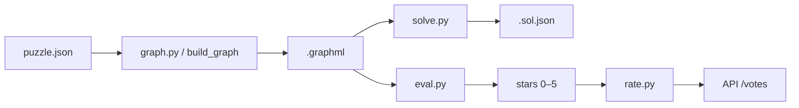

# Klotski AP2 — Memòria tècnica

Resolució de puzzles de peces lliscants modelant l'**espai d'estats** com a graf: construcció del graf, solució mínima, heurística d'interès (0–5 estrelles) i integració amb el repositori col·laboratiu. 

## Índex

- [Guia ràpida (corrector)](#guia-rapida-corrector)
- [Objectiu i pipeline](#objectiu-del-projecte)
- [Estructura del codi](#estructura-del-codi)
- [Model de dades](#model-de-dades) · [API](#api-del-repositori)
- [Desenvolupament cronològic](#desenvolupament-cronològic-apartat-principal) — `download` → `graph` → `solve` → `eval` → `rate` → `generate`
- [Investigació (`graph-tool` i 3D)](#investigació-1-algorismes-de-graph-tool-per-a-evalpy)
- [Estat i entrega](#estat-del-projecte-i-pendents)

## Guia ràpida (corrector) {#guia-rapida-corrector}

**Què revisar primer**

| Pregunta | On mirar |
|----------|----------|
| Com es modela un puzzle? | [Model de dades](#model-de-dades) |
| Com es construeix el graf? | [Pas 2 — graph.py](#pas-2---graphpy) |
| Com es resol? | [Pas 3 — solve.py](#pas-3---solvepy) |
| Com es mesura l'«interès»? | [Pas 4 — eval.py](#pas-4---evalpy) (fórmula + taules) |
| Per què aquestes mètriques? | [Investigació 1 i 2](#investigació-1-algorismes-de-graph-tool-per-a-evalpy) |

**Verificació en un puzzle d'exemple** (`puzzles/sample3.json`):

```bash
pixi install
pixi run python src/graph.py puzzles/sample3.json
pixi run python src/solve.py puzzles/sample3.json
pixi run python src/eval.py puzzles/sample3.json --json
pixi run python src/3D_view.py puzzles/sample3.graphml puzzles/sample3.sol.json
```

**Convenció de fitxers**: `foo.json` → `foo.graphml` (mateix directori). `solve.py` i `eval.py` generen el `.graphml` si no existeix (mateix BFS que `graph.py`).



## Objectiu del projecte

- Construir el graf d'estats d'un puzzle Klotski.
- Trobar una solució mínima com a seqüència de moviments.
- Definir i justificar una heurística d'interès (0–5 estrelles) a partir de mètriques de `graph-tool`.
- Interactuar amb l'API: descarregar puzzles, enviar valoracions (`rate.py`); generar candidats (`generate.py`).

## Estructura del codi

Núcli:

- [src/puzzle.py](src/puzzle.py), [src/logic.py](src/logic.py): model i moviments.
- [src/graph.py](src/graph.py): graf d'estats → `.graphml`.
- [src/solve.py](src/solve.py): camí mínim → `.sol.json`.
- [src/eval.py](src/eval.py): mètriques + `score_terms` + `stars`.
- [src/rate.py](src/rate.py): POST de valoració a l'API.
- [src/download.py](src/download.py): descàrrega des del repositori.
- [src/generate.py](src/generate.py): generació aleatòria filtrada per `eval.py`.

Suport (validació / demo): [play.py](src/play.py), [image.py](src/image.py), [movie.py](src/movie.py), [3D_view.py](src/3D_view.py).

## Model de dades {#model-de-dades}

Format JSON del puzzle:

```json
{
  "W": 4,
  "H": 5,
  "walls": [[x, y], ...],
  "pieces": [[[rx, ry], ...], ...],
  "start": [[x, y], ...],
  "goals": [{"i": 0, "pos": [x, y]}, ...]
}
```

Criteris clau:

- Les peces es defineixen amb coordenades relatives normalitzades (sense valors negatius).
- La posició de cada peça és la cantonada superior esquerra del rectangle contenidor.
- Un estat és la llista de posicions de totes les peces, en ordre canònic.
- Un puzzle està resolt quan es compleixen tots els objectius.

Format de moviments (.sol.json):

```json
[[piece_index, "N"], [piece_index, "E"], ...]
```

## API del repositori {#api-del-repositori}

Base URL: https://klotski.pauek.dev

- GET /api/puzzles: retorna IDs de puzzles.
- GET /api/puzzles/<id>: retorna puzzle + estrelles.
- POST /api/puzzles: pujada de puzzle (requereix token).
- POST /api/puzzles/<id>/votes: enviament de vot enter 0–5 (requereix token).

## Desenvolupament cronològic (apartat principal) {#desenvolupament-cronològic-apartat-principal}

Ordre real de construcció. Cada pas: finalitat + comandes.

### Pas 0 - Preparació de l'entorn

Instal·lació de dependències i preparació de l'entorn de treball.

```bash
pixi install
```

### Pas 1 - download.py

Primer script implementat. Connecta amb l'API pública del repositori per obtenir la llista de puzzles disponibles i descarregar-los en format JSON.

El flux és el següent:
1. GET /api/puzzles retorna una llista d'IDs (hash SHA-256 de cada puzzle).
2. Per cada ID, GET /api/puzzles/<id> retorna el puzzle en JSON.
3. Cada puzzle es valida amb Puzzle.from_json() per assegurar que el format és correcte.
4. Es desa a puzzles/<id>.json amb indentació per facilitar la lectura.

Permet seleccionar IDs concrets o limitar el nombre de descàrregues. Si un puzzle falla (xarxa o format invalid), el reporta pero continua amb la resta.

Per consultar IDs directament des de l'API:

```bash
# Veure tots els identificadors
curl https://klotski.pauek.dev/api/puzzles

# Veure els primers 10 identificadors, formatats
curl -s https://klotski.pauek.dev/api/puzzles | jq '.[0:10]'

# Veure només el primer identificador
curl -s https://klotski.pauek.dev/api/puzzles | jq -r '.[0]'
```

```bash
# Descarregar el top complet (fins a 100)
pixi run python src/download.py

# Descarregar només N puzzles
pixi run python src/download.py --limit 10

# Descarregar un o diversos IDs concrets
pixi run python src/download.py --id <ID>
pixi run python src/download.py --id <ID1> --id <ID2>

# Triar carpeta de sortida
pixi run python src/download.py --limit 10 --out altra_carpeta
```

### Pas 2 - graph.py {#pas-2---graphpy}

Segon script implementat. Construeix el graf d'estats accessibles des de l'estat inicial del puzzle.

Model utilitzat:
1. Node = un estat complet del puzzle (posició de totes les peces).
2. Aresta = un moviment vàlid d'un sol pas entre dos estats.
3. Exploració BFS des de l'estat inicial fins a esgotar tots els estats accessibles.

Sortida:
- Fitxer `.graphml` per cada puzzle (per defecte amb el mateix nom del `.json`).
- El graf guarda metadades de node (`state`, `is_start`, `is_goal`) i el `puzzle` original.

Comandes:

```bash
# Crear el graf amb nom de sortida per defecte
pixi run python src/graph.py puzzles/sample3.json

# Crear el graf amb nom de sortida explícit
pixi run python src/graph.py puzzles/sample3.json puzzles/sample3.graphml
```

Nota de visualització:
- Obrir directament un `.graphml` al navegador mostra XML (text), no una imatge.
- Per veure el graf en 3D, cal executar el visor `3D_view.py`.

```bash
# Veure el graf sense camí de solució
pixi run python src/3D_view.py puzzles/sample3.graphml

# Veure el graf amb el camí de solució ressaltat (groc)
pixi run python src/3D_view.py puzzles/sample3.graphml puzzles/sample3.sol.json
```

### Pas 3 - solve.py {#pas-3---solvepy}

Tercer script implementat. Troba una solució mínima sobre el graf d'estats i la desa en format `.sol.json`.

Funcionalitat principal:
1. Carrega el puzzle i el `.graphml` associat (o el genera; vegeu [convenció de fitxers](#guia-rapida-corrector)).
2. Busca el camí més curt des del node inicial fins a un node objectiu.
3. Converteix la seqüència d'estats a moviments `[peça, direcció]`.
4. Desa la solució en un fitxer `.sol.json`.

Comandes:

```bash
# Mode mínim: puzzle -> usa <puzzle>.graphml i desa <puzzle>.sol.json
pixi run python src/solve.py puzzles/sample3.json

# Indicant fitxer de graf explícit
pixi run python src/solve.py puzzles/sample3.json puzzles/sample3.graphml

# Indicant graf i nom de sortida de la solució
pixi run python src/solve.py puzzles/sample3.json puzzles/sample3.graphml puzzles/sample3.sol.json
```

Validació feta:
1. Compatible amb visualització 3D del camí:

```bash
pixi run python src/3D_view.py puzzles/sample3.graphml puzzles/sample3.sol.json
```

2. Compatible amb render de pel·lícula GIF:

```bash
pixi run python src/movie.py puzzles/sample3.json puzzles/sample3.sol.json img/sample3.gif
```

### Pas 4 - eval.py {#pas-4---evalpy}

Quart script implementat. Assigna **interès** entre **0 i 5 estrelles** (`stars`) a partir del graf d'estats. Alimenta `rate.py` i filtra candidats de `generate.py`.

Funcionalitat principal:

1. Carrega puzzle + `.graphml` (o el genera; vegeu [convenció](#guia-rapida-corrector)).
2. `compute_metrics` — mètriques amb `graph-tool` ([Investigació 1](#investigació-1-algorismes-de-graph-tool-per-a-evalpy)).
3. `compute_score_terms` — termes normalitzats L, P, K, R, S, C, D, T ∈ [0, 1].
4. `score_from_metrics` — combinació ponderada → `stars`.

#### Criteri d'«interès»

Combinació **subjectiva però explícita** de: solució llarga (L), camí no trivial respecte la mida del graf (P), colls d'ampolla en estats (K), ramificació moderada (R), espai d'estats gran (S), lleu clustering (C), i penalitzacions per dead-ends (D) i puzzles massa petits o curts (T). Justificació visual: [Investigació 2](#investigació-2-visualitzar-grafs-i-justificar-la-fórmula). Si `solvable` és fals → **stars = 0**.

#### Mètriques del graf (`compute_metrics`)

| Mètrica | Descripció | En `stars` |
|---------|------------|------------|
| `solvable` | Objectiu accessible des de l'inicial | Prerequisit (si no, 0 estrelles) |
| `min_solution_len` | Moviments mínims fins a un objectiu; −1 si no resoluble | L |
| `path_density` | `min_solution_len / log10(nodes + 1)` | P |
| `nodes`, `edges` | Estats i transicions accessibles | S (via `nodes`) |
| `avg_degree` | Moviments possibles per estat (mitjana) | R |
| `dead_end_ratio` | Fracció d'estats amb un sol moviment (sense inici/objectiu) | D |
| `global_clustering` | Connexió local entre veïns (`graph-tool`) | C |
| `max_vertex_betweenness` | Coll d'ampolla en **estats** (camins que hi passen) | K |
| `max_edge_betweenness` | Coll d'ampolla en **moviments**; requereix `--with-betweenness` | No (informativa) |
| `connected_components` | Components connexes | Validació (habitualment 1) |

#### Termes de puntuació (0–1)

Tots els termes es limiten amb `clamp01(x) = min(1, max(0, x))`:

| Terme | Pes | Fórmula | Interpretació |
|-------|-----|---------|---------------|
| **L** | +35 % | `clamp(min_len/80) * clamp(min_len/10)` | Solució llarga; penalitza menys de 10 moviments |
| **P** | +15 % | `clamp(path_density/8)` | El camí solució «ocupa» bé l'espai explorat |
| **K** | +15 % | `clamp(max_vertex_betweenness / (0.15*n))` | Coll d'ampolla clar (fases, ponts estrets) |
| **R** | +15 % | `clamp(1 - abs(avg_degree-2.8)/2.8)` | Ramificació al volt de 2.8 |
| **S** | +15 % | `clamp(log10(n+1)/5) * clamp(n/50)` | Graf gran; mínim ~50 nodes |
| **C** | +5 % | `clamp(global_clustering/0.25)` | Densitat local (secundari) |
| **D** | −15 % | `clamp(dead_end_ratio/0.60)` | Massa estats «passadís» |
| **T** | −10 % | `clamp(0.5*t_len + 0.5*t_size)` | Puzzle massa petit o fàcil (`t_len` si `min_len < 10`, `t_size` si `nodes < 50`) |

Combinació final:

```text
raw = 0.35*L + 0.15*P + 0.15*K + 0.15*R + 0.15*S + 0.05*C - 0.15*D - 0.10*T
raw = clamp(raw)
stars = 5 * raw
```

Sortida `--json`: mètriques, `score_terms`, `stars`. El flag `--with-betweenness` només afegeix `max_edge_betweenness` al JSON.

Comandes:

```bash
pixi run python src/eval.py puzzles/sample3.json
pixi run python src/eval.py puzzles/<id>.json --json
pixi run python src/eval.py puzzles/<id>.json --json --with-betweenness   # opcional
```

### Pas 5 - rate.py {#pas-5---ratepy}

Cinquè script implementat. Envia una valoració (estrelles) d'un puzzle al repositori via API.

Funcionalitat principal:
1. Rep el fitxer `.json` del puzzle i el token d'autenticació.
2. Calcula la puntuació amb `eval.py` (mateixa fórmula que l'avaluació local).
3. Fa POST a `/api/puzzles/<id>/votes` amb `stars` en decimal (0.0–5.0, arrodonit a 2 decimals).

L'ID del puzzle és el nom del fitxer sense extensió. Si el fitxer ve de `download.py`, el nom ja és el hash SHA-256.

Comandes:

```bash
# Enviar vot (requereix token UPC)
pixi run python src/rate.py puzzles/<id>.json --token <TOKEN>

# Provar sense enviar
pixi run python src/rate.py puzzles/<id>.json --token <TOKEN> --dry-run
```

### Pas 6 - generate.py {#pas-6---generatepy}

Genera puzzles aleatoris i en retorna un que supera `min-stars` segons la mateixa heurística que `eval.py`.

Flux:

1. Genera `candidates` puzzles aleatoris (peces, parets, objectius).
2. Filtra ràpidament insolubles (BFS limitat).
3. Construeix el graf complet dels supervivents i avalua amb `eval.py`.
4. Desa el millor a `--out` (per defecte `puzzles/generated_<hash>.json`).

```bash
pixi run python src/generate.py --candidates 20 --min-stars 2.0 --out puzzles/nou.json
pixi run python src/generate.py --width 4 --height 5 --pieces 8 --seed 42
```

## Investigació 1: algorismes de `graph-tool` per a `eval.py` {#investigació-1-algorismes-de-graph-tool-per-a-evalpy}

Durant el desenvolupament vam revisar el catàleg de `graph-tool` (centralitats, components, camins mínims, clustering). A `eval.py` en fem servir només aquestes funcions:

| Funció | Paper a la puntuació |
|--------|----------------------|
| `shortest_distance` | `min_solution_len`, `solvable`, `path_density` (termes L, P) |
| `betweenness` | `max_vertex_betweenness` (terme K); arestes només amb `--with-betweenness` |
| `global_clustering` | Terme C |
| `label_components` | Validació (`connected_components`; en el nostre flux sol ser 1) |

Altres funcions (`shortest_path`, `pagerank`, …) les vam considerar però no entren a la fórmula: `solve.py` ja resol el camí mínim i les centralitats alternatives no aportaven criteri clar davant la visualització 3D.

## Investigació 2: visualitzar grafs i justificar la fórmula {#investigació-2-visualitzar-grafs-i-justificar-la-fórmula}

Metodologia: `3D_view.py` (camí mínim en groc amb `.sol.json`) + prova manual amb `play.py`; contrastar amb `stars` de `eval.py`.

| Puzzle | Sol. mínima | Observació visual | Efecte a `eval.py` |
|--------|-------------|-------------------|---------------------|
| `2swap` | 17 | Graf compacte, poc ramificat | L i S moderats |
| `sample3` | 29 | Camí llarg, reorganització intermèdia | L i P elevats |
| `simplicity` | 31 | Fases abans d'arribar a l'objectiu | L alt; K si hi ha «pont» central |

| El que es veu al 3D | Terme / mètrica |
|--------------------|-----------------|
| Camí llarg en groc | L, P |
| «Pont» estret (estat obligatori) | K (`max_vertex_betweenness`) |
| Molts nodes | S |
| Graf lineal, passadissos | D ↑, C ↓ |
| Puzzle petit o solució curta | T ↑, L ↓ |

```bash
pixi run python src/3D_view.py puzzles/sample3.graphml puzzles/sample3.sol.json
pixi run python src/play.py puzzles/sample3.json
```

## Eines de suport

`play.py`, `image.py`, `movie.py`, `3D_view.py` — validació manual; fora del pipeline API.

## Estat del projecte i pendents {#estat-del-projecte-i-pendents}

| Eina | Estat |
|------|--------|
| `download.py`, `graph.py`, `solve.py`, `eval.py`, `rate.py`, `generate.py` | Implementats |
| `upload.py` | Pendent |
| `rate_all.py` | Opcional |

**Flux col·laboratiu**: `download` → `eval --json` → `rate --token`.

**Entrega**: ZIP sense `.pixi` (~1.3 GB).

